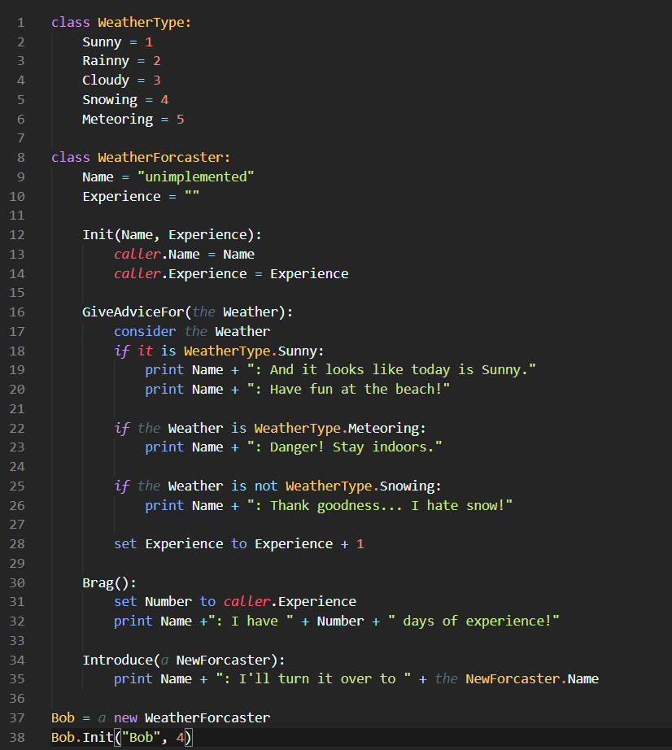

# Pebble
Pebble is a programming language designed to read like English. 

Knowledge of programming is becoming both useful and necessary. Every day we interact with technology. Code governs some of our most nuclear and personal experiences. But we often take that code for granted, and we treat it as a black box.

We're developing Pebble because we believe that knowledge of coding is vital to be informed citizens and well rounded individuals. Our goal is to create a language that anyone can pickup, understand, and master. It is our hope that in the process, newcomers will develop a stronger understanding of how code works and a more nuanced understanding of how coding can impact our society. In short, our mission is to make learning to program accessible to everyone.

Currently Pebble is in early beta and many features are unimplemented. Please check frequently for updates.

## Using Pebble
Pebble is an intepreted language built over C++. Currently it uses an experimental syntax (codenamed Boulder) for testing purposes, but the eventual goal is to parse less structured sentences as well.

 To write programs in Pebble, you will first need to install a make utility and `g++` or some other C++ compiler. 
 * Clone the Pebble repo and run the `make` command in the repo root directory. This should produce a new file `pebble.exe`
 * In this same directory create a file titled `program.pebl` and write any Pebble code you would like to execute in this file.
 * Run your program by opening a shell/command line and running the command `./pebble.exe`

## Language Specifications
### Overview of Ideas
Pebble abstracts coding into three fundemental, interrelated concepts. References, Objects, and Methods. Building on those are the ideas of Scope and Block

#### References
References are names and nouns. In real life they're the words we use to refer to things. For example, `Bob` can be used to refer a person (named Bob of course). Other references to that same person might be `Him` or `the Person`. In Pebble, references always start with a capital letter, just like with proper nouns in English. References can point to either an Object or a Method.

#### Objects
Objects are the things. In the example above, `Bob`, `Him`, and `the Person` are all references to the same underlying thing--in this case my friend Bob. Objects in Pebble have attributes (eg. `Bob's Wallet`) which are themselves references.

#### Methods
Methods are the actions which can be done on objects. They're also named by references (eg. `DriveMyCar()`). 

#### Scope
Scope refers to the references available at a given place in the code. When `Bob` evaluates a method, any references are evaluated in his scope. If `Alice` had some attribute `SecretLetter`, the clearly `Bob` would not be able to access it!

#### Blocks
Blocks are lines of code with the same scope. The `:` operator tells the Pebble interpreter that a block is expected. Blocks also inherit the scope of the block caller.

### Overview of Keywords
#### Control Flow
These keywords are used in the obvious way
* `if <expr> :`
* `for each <Ref> in <Expr> :`
* `while <expr> :`

Each of these expects a block which inherits the program scope at each call.

#### Operations
These keywords signal binary operations in the obvious way
* Math: `+ - * /`
* Logic: `and && or ||`
* Comparison: `> < >= <= == != is (is not)`

These keywords signal unary operations in the obvious way
* Logic: `not !`

#### Articles
The definite and indefinite articles `the`, `a`, and `an` can be used to improve readability, they are treated as enclosed commments by the interpreter and ignored.

#### Evaluation
The keywords `consider` and `take` can be used before an expression to explicitly keep the result of executing the expression in the program memory. The immediate last result can be referenced by the keywords `it` and `that` to break up and simplify chaining.

#### Caller
The keyword `caller` should be used from inside a method and refers to the object which calls the method. If the method is global, and has no caller, then `Nothing` will be passed in as the caller

### Example Code

